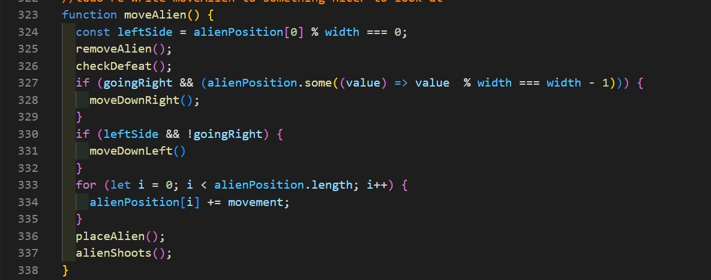

# Defender!

## Description

This project was assigned at the end of the third week of General Assembly’s 3-month SEI (Software Engineering Immersive) course, in which I studied the fundamentals of software engineering with the aim to launch a career in this sector. The aim of the project was to design a game from scratch within one week, working individually. I chose to build Space Invaders.

## Deployment link
https://codebyjet.github.io/ga-project-1/
----

## Setup:
Clone the repo locally, then open in VS code, using:
‘code .’
Then: npm start

## Technologies Used:
To complete this project I employed JavaScript and jQuery for the functionality, HTML for the basic layout of all elements, and CSS for the styling.

----

## Brief:
With this project, we were given the brief to build a game in one week, working on our own. The game could be one of six pre-chosen games. I picked Space Invaders, as it's an old school classic, and I found it to be the most engaging of the choices.

Our game had to:
- Make the "Invaders" move in their classic left, down, right down repeat movement.
- the player must get a score of some sort.
- The Aliens and player had to shoot each other
- The player was only able to move left to right.

After the week, we had to give a presentation of our game.

## Planning:
The first day of the project, I spent planning it out, with a rough idea of what I wanted the end result to look like, what functions I thought I would need and how I may implement them. I used excalidraw to plan the wireframe of my game.

I did some light pseudocode of how the functions might work out or need, along with a list I believed would be the order to work through.

---
If you do wish to see the full excalidraw, as it it fairly long, please do check my "readme_extras/excalidraw_Imageboard.png"

---
## Stage 1: The Grid
Starting with the grid, I thought this would be where to start, as without it, nothing would appear or run. I made a 10 by 10 grid of divs within a div that held the dimensions that I was aiming for. I originally started with a grid twice the size it ended up being, as I didn't like how small all the sprites looked in the end result.

## Stage 2: Player Movement
I created functions to respond to the arrow keys that kept the player along the bottom of the grid. Making sure he couldn't accidentally go off the grid.

`
function movePlayer(event) {
  const x = playerPosition % width;
  const y = Math.floor(playerPosition / width);
  if (event.key === "ArrowRight" && x < width - 1) {
    moveRight();
  } else if (event.key === "ArrowLeft" && x > 0) {
    moveLeft();
  }
}
`

## Stage 3: Alien movement
The alien movement was created using an interval timer I called gameScaling. This pushed the aliens along the top of the grid, dropped them down and moved them in the opposite direction. I created a couple of variables to do this. A boolean that said if they should being going left or right, and a movement variable that was altered as the aliens moved along

## Stage 4: Shooting
The player is able to shoot, and the aliens can shoot. I based the player being able to shoot being tied to a variable that was the distance of the grid. This stopped the player from just holding down space and getting rid of everything on the screen, and created a sense of urgency and precision with their shots.
When the shot moves into a grid with the class name of the invaders, the invader would be sliced off the array it was on, preventing accidental revival of the enemies when they moved.

The hardest part of this was fixing it so the shot didn't kill more than one alien, and that the player could shoot again when the alien died. This was fixed by clearing the timer after each collision.

`  
if (cells[missilePosition].classList.contains("invader")) {
    scoreUp();
    for (let i = 0; i < alienPosition.length; i++) {
      if (alienPosition[i] === missilePosition) {
        cells[alienPosition[i]].classList.remove("invader");
        alienPosition.splice(i, 1);
        checkRespawn();
      }
    }
    endMissile();
  }
`

The alien shooting was tied to a similar variable, but instead of slicing off an array, if the player's position was the same as the alien laser, then the player lost a life point, 3 strikes and it's game over.

## Stage 5: Respawning aliens
The game wouldn't be much fun if it ended after one round. So I created a copy of the array the original wave was created from. Using this array, I pushed each value onto the old array, cleared the interval and started the wave off again.
This is where the gameScaling interval came in handy, after each wave of aliens, I would reduce the interval by 100 milliseconds.

## Stage 6: Game Over
Now that I had implemented how the game works, I needed to create a function that ended the game, either when the aliens landed, or when the player lost all his life points.
I had some problems with the aliens respawning or continuing to move and shoot after you had died. But I fixed these by changing when certain parts of the code were called.

## Stage 7: Test game
I tested the game many, many times. I wanted to be sure that the base level of the game worked before I implemented any extra features or added the styling I wanted it to look like.

## Stage 8: The styling
I wanted to keep an old school retro feel, but I also wanted to make this joke about the graphics costing more. Just my sense of humour.
The first thing was the "MVP" styling, the no-graphics enabled look. This was easily done, I made the player, alien, missile and lasers different coloured blocks. Did some basic layouts of the game

The stylized actual look out to the game, is enabled through a "graphics?" button. The actual styling I wanted to keep in a lot of blues, pinks and greens, with some key text points in red.
The health points, in the graphics enabled, were 3 pictures of the old school heart containers, that pulsed as you played the game.

The title is a h1 with 2 spans inside it of the same title. With a combination of position absolute and text shadows and some basic animations. I was able to create that glitched out and fragmented look.
I created two game over screens to also go with the look

## Stage 8: Bonus features.
Now that the game was styled and the basics looked how I wanted them to, I had a series of bonuses I wanted to add.
I added an animation for when you got shot, the screen would shake.
A leaderboard system that uses local storage data to create and display your leader board.
I added background music, that I had found on a royalty free music site, it and all the sound affects, can be toggled on and off (Laser noises and pew-pew sound effects were added for the alien and player respectfully)

I added a Mothership style boss, she has 4 guards around her who are invincible, and you have to shoot her 3 times to win. Her spawn was tied to a const I called 'game scale' - This scale was the movement for the aliens, after each wave, the number was decreased, so the aliens moved faster - Once it reached a certain thresh hold, the mother ship would spawn.

`
function checkRespawn() {
  if (endlessMode === false){
    if (alienPosition.length === 0) {
      endLaser()
      clearInterval(alienInterval);
      gameScaling = gameScaling - 100
      if (gameScaling < 500){
        alert("Watch out! The Mothership is coming! You will have to shoot her at least three times to give us enough time to evacuate more people!")
        aliensCanShoot = false;
        placeMotherShip()
        placeGuards()
        guardInterval = setInterval(moveGuards, 400)
      } else {
        respawning.forEach((spawn) => alienPosition.push(spawn));
        placeAlien();
        alienInterval = setInterval(moveAlien, gameScaling);
      }
    }
`

Added two victory screens for when you defeat her(styled and unstyled).

I created an endless mode. In the old school games I grew up with, some had this secret code, that when inputted unlocked bonus features. I wanted to recreate that feeling with an endless mode. When the player is asked for their name after the Mothership is dead, if you type in "Endless", it will refresh the player's life points and enable an endless mode, where the aliens are quicker than usual.
I added bullet collision, so when the two projectiles hit each other, both are removed. But this was causing some problems with re-firing missiles at times, so this was removed in the final product.
I added a smoke "poof" effect when the player shoots, that after a set period of time, removes itself.

## Update:
Added mobile controls too - On screens that are smaller, left, right and shoot buttons appear for the player to click.

## Wins?
Overall I was really happy with the styled and unstyled joke and how the finished product looked, the sound board also had a great retro feel.

## Bugs?
Occasionally if the palyer holds down or really spams the spacebar to shoot, then the game ends, I wasn't sure how to fix this, and is sadly still in the game. I have prevent default in the event listener for the spacebar, but this did not fix the issue.

## Future Improvements:
In future iterations, I would find a way, other than assigning different classes, to alternate or randomise the colours of the aliens. I wanted to have pink and blue aliens at the same time. I would like to add power ups, so when the player collects certain, randomly timed, objects, that they added something to how the player can interact and play.
